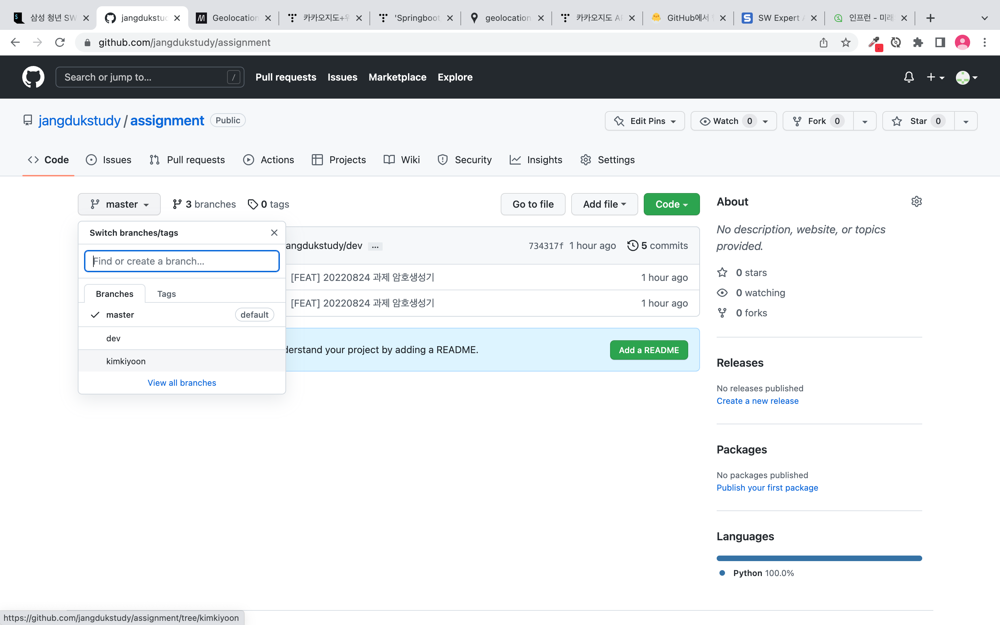
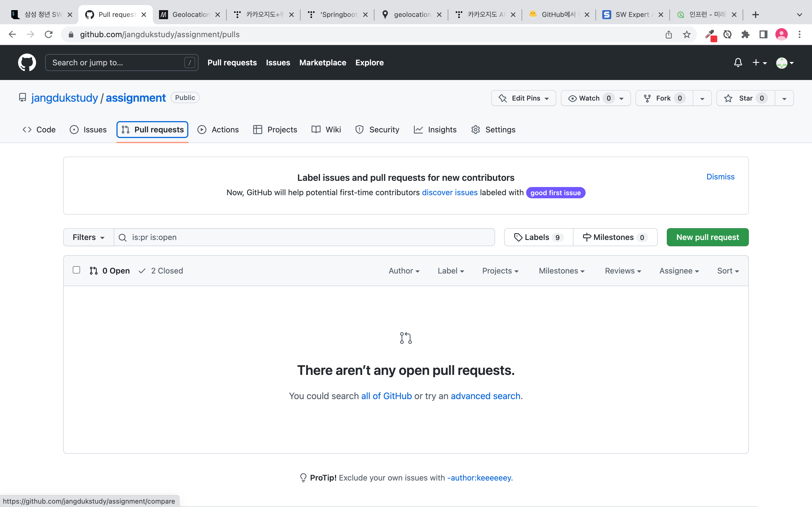
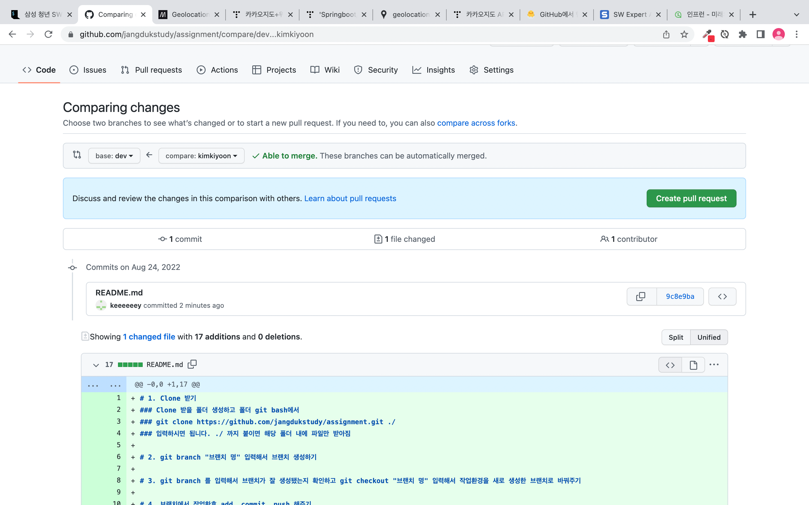
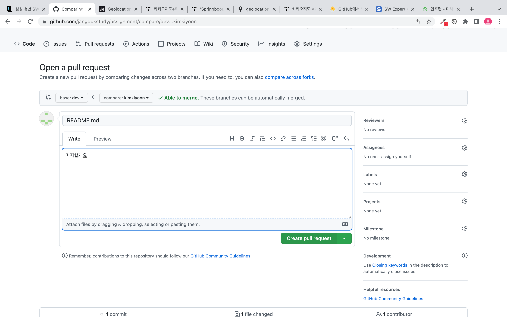
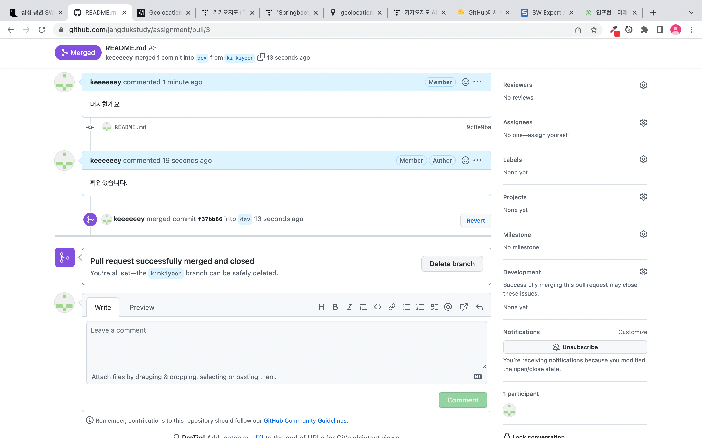

# 1. Clone 받기
### Clone 받을 폴더 생성하고 폴더내 git bash에서 
### git clone https://github.com/jangdukstudy/assignment.git ./
### 입력하시면 됩니다. ./ 까지 붙이면 해당 폴더 내에 파일만 받아짐

# 2. git branch 브랜치 명 입력해서 브랜치 생성하기

# 3. git branch 를 입력해서 브랜치가 잘 생성됐는지 확인하고 git checkout 브랜치 명 입력해서 작업환경을 새로 생성한 브랜치로 바꿔주기

# 4. 브랜치에서 작업한후 add, commit, push 해주기
# 이때 git push origin master가 아닌 git push origin 브랜치 명 으로 해줘야 합니다.

# 5. push하고 나면 아래와 같이 내 브랜치가 생성된 걸 확인할 수 있음

# 6. 위에 네비게이션에서 Pull requests 탭에 있는 New pull reuqest라는 초록색 버튼 클릭

# 6. 본인 브랜치에서 -> dev로 선택하고 Create pull request 버튼 클릭

# 7. 아무 코멘트 달고 Create pull request 버튼 클릭

# 8. 머지 완료 되면 Delete branch 버튼 눌러서 브랜치 삭제

# 다음번에 할때는 Clone이 아닌 git pull origin master로 풀 받은 후 똑같이 브랜치 생성하고 작업하시면 됩니다.